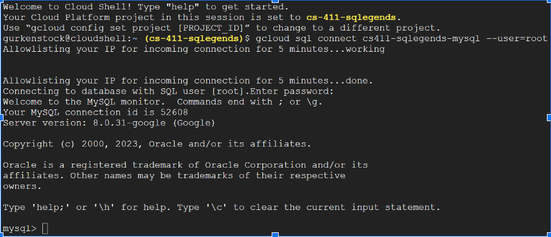

# DDL Code
CREATE TABLE Report(\
   &nbsp;&nbsp;&nbsp;&nbsp;&nbsp;&nbsp;Division of Records Number INT,\
   &nbsp;&nbsp;&nbsp;&nbsp;&nbsp;&nbsp;Date Reported DATE,\
   &nbsp;&nbsp;&nbsp;&nbsp;&nbsp;&nbsp;Date Occurred DATE, Time Occurred TIME,\
   &nbsp;&nbsp;&nbsp;&nbsp;&nbsp;&nbsp;Latitude REAL,\
   &nbsp;&nbsp;&nbsp;&nbsp;&nbsp;&nbsp;Longitude REAL,  
   &nbsp;&nbsp;&nbsp;&nbsp;&nbsp;&nbsp;Crime Code REAL,\
   &nbsp;&nbsp;&nbsp;&nbsp;&nbsp;&nbsp;Weapon Used Code INT,\
   &nbsp;&nbsp;&nbsp;&nbsp;&nbsp;&nbsp;MO Code REAL,\
   &nbsp;&nbsp;&nbsp;&nbsp;&nbsp;&nbsp;Area INT,  
   &nbsp;&nbsp;&nbsp;&nbsp;&nbsp;&nbsp;Premises Code INT,  
   &nbsp;&nbsp;&nbsp;&nbsp;&nbsp;&nbsp;PRIMARY KEY(Division of Records Number),  
   &nbsp;&nbsp;&nbsp;&nbsp;&nbsp;&nbsp;FOREIGN KEY(Crime Code) REFERENCES Crime Codes(Crime Code), \
   &nbsp;&nbsp;&nbsp;&nbsp;&nbsp;&nbsp;FOREIGN KEY(Weapon Used Code) REFERENCES Weapon(Weapon Used Code),\
   &nbsp;&nbsp;&nbsp;&nbsp;&nbsp;&nbsp;FOREIGN KEY(MO Code) REFERENCES Modus Operandi(MO Code), \
   &nbsp;&nbsp;&nbsp;&nbsp;&nbsp;&nbsp;FOREIGN KEY(Area) REFERENCES Location(Area), \
   &nbsp;&nbsp;&nbsp;&nbsp;&nbsp;&nbsp;FOREIGN KEY(Premises Code) REFERENCES Premises(Premises Code)\
);

CREATE TABLE Victim(\
   &nbsp;&nbsp;&nbsp;&nbsp;&nbsp;&nbsp;Division of Record Number INT, \
   &nbsp;&nbsp;&nbsp;&nbsp;&nbsp;&nbsp;Age INT,\
   &nbsp;&nbsp;&nbsp;&nbsp;&nbsp;&nbsp;Sex VARCHAR(255), \
   &nbsp;&nbsp;&nbsp;&nbsp;&nbsp;&nbsp;Descent VARCHAR(255), \
   &nbsp;&nbsp;&nbsp;&nbsp;&nbsp;&nbsp;Descent Description VARCHAR(255),  
   &nbsp;&nbsp;&nbsp;&nbsp;&nbsp;&nbsp;PRIMARY KEY(Division of Record Number)\
);

CREATE TABLE Premises(\
   &nbsp;&nbsp;&nbsp;&nbsp;&nbsp;&nbsp; Premises Code INT,\
   &nbsp;&nbsp;&nbsp;&nbsp;&nbsp;&nbsp; Premises Description VARCHAR(255),  
   &nbsp;&nbsp;&nbsp;&nbsp;&nbsp;&nbsp; PRIMARY KEY(Premises Code)\
);

CREATE TABLE Location(\
   &nbsp;&nbsp;&nbsp;&nbsp;&nbsp;&nbsp; Area INT,  
   &nbsp;&nbsp;&nbsp;&nbsp;&nbsp;&nbsp; Area Name VARCHAR(255),\ 
   &nbsp;&nbsp;&nbsp;&nbsp;&nbsp;&nbsp; PRIMARY KEY(Area)\
);

CREATE TABLE Weapon Used(\
    &nbsp;&nbsp;&nbsp;&nbsp;&nbsp;&nbsp;Weapon Used Code REAL,   
    &nbsp;&nbsp;&nbsp;&nbsp;&nbsp;&nbsp;Weapon Description VARCHAR(255),  
    &nbsp;&nbsp;&nbsp;&nbsp;&nbsp;&nbsp;PRIMARY KEY(Weapon Used Code)\
);

CREATE TABLE Modus Operandi(\
    &nbsp;&nbsp;&nbsp;&nbsp;&nbsp;&nbsp;MO Code REAL,  
    &nbsp;&nbsp;&nbsp;&nbsp;&nbsp;&nbsp;MO Description VARCHAR(255),  
    &nbsp;&nbsp;&nbsp;&nbsp;&nbsp;&nbsp;PRIMARY KEY(MO Code)  
);

CREATE TABLE Crime Codes(\
    &nbsp;&nbsp;&nbsp;&nbsp;&nbsp;&nbsp;Crime Code REAL,  
    &nbsp;&nbsp;&nbsp;&nbsp;&nbsp;&nbsp;Crime Code Description VARCHAR(255), \
    &nbsp;&nbsp;&nbsp;&nbsp;&nbsp;&nbsp;PRIMARY KEY(Crime Code)\
);

# Data tables

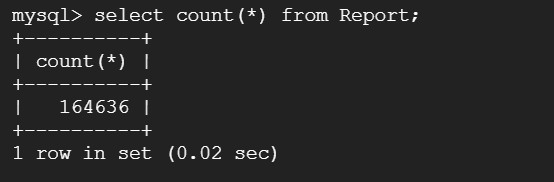

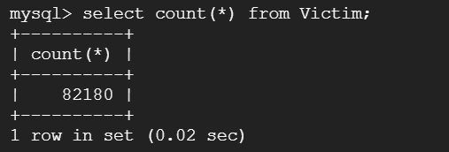

# SQL Queries
### What communities have the most crime in LA (ordering):
SELECT Location.areaName, COUNT(Location.areaName) AS CRIMECOUNT FROM (Report JOIN Location ON Location.area = Report.area) GROUP BY Location.areaName ORDER BY CRIMECOUNT LIMIT 15;

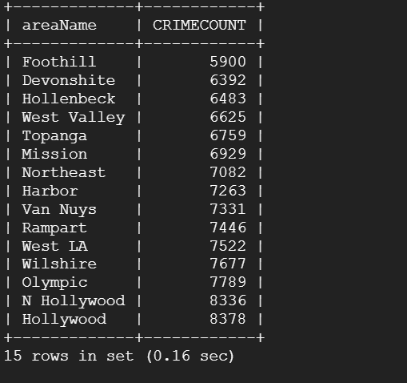

### What are the demographics of crime victims (age, sex, descent) IN A GIVEN YEAR
SELECT Victim.descent, COUNT(Victim.descent) AS descentCount FROM Victim JOIN Report ON Report.divisionRecordsNumber = Victim.divisionRecordsNumber WHERE YEAR(Report.dateOccurred) = 2021 GROUP BY Victim.descent ORDER by descentCount LIMIT 15;

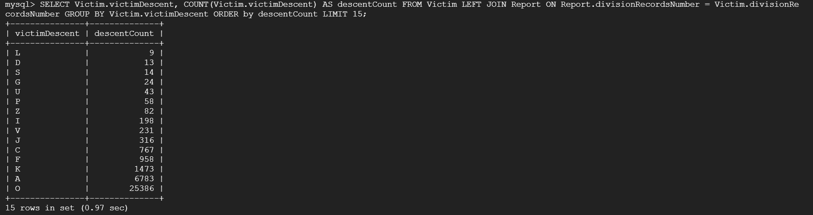

# Index Analysis

## Query 1

### No Index
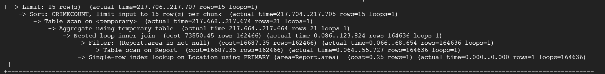

### Index On Area

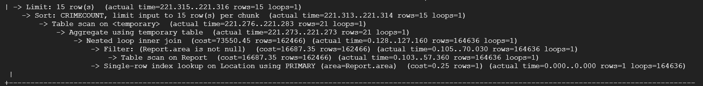

### Index on AreaName

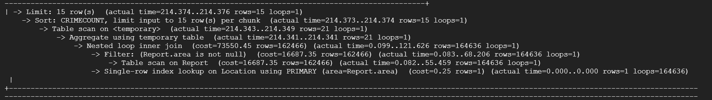

### Index on Area and AreaName

None of the indexes that we tried produced a significant difference in performance. Therefore, for this query there is no reason to use them.

## Query 2

### No Index

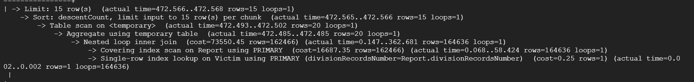

### Index on division of records number for records table

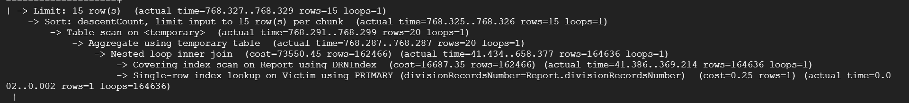

### Index on Victim Descent

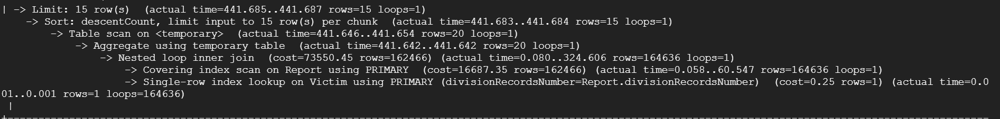

### Index on Victim Descent and Index on division of records number for records table

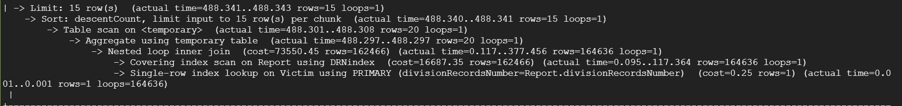

The index does not reduce the scan cost and rows. However, it does increases the inner join cost. The costs can be higher for a table with a non-optimal clustered index, followed by on tables with a non-clustered index or no indexes at all.
