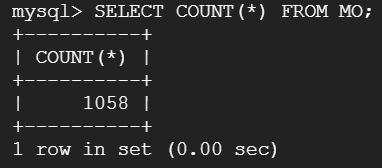
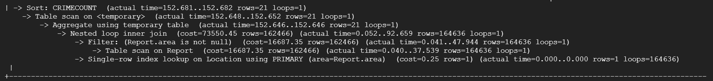
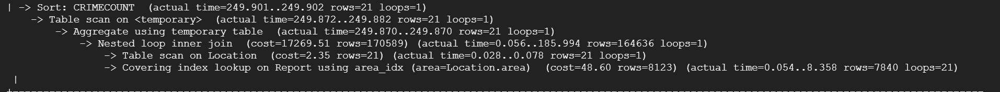
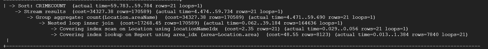
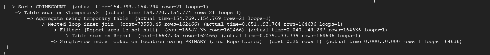
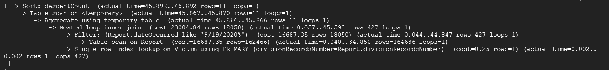
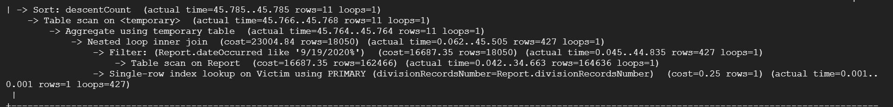
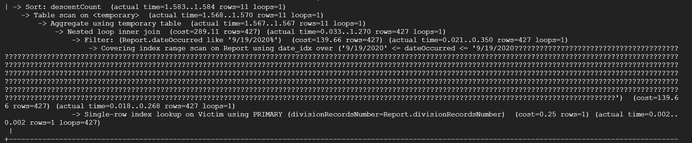
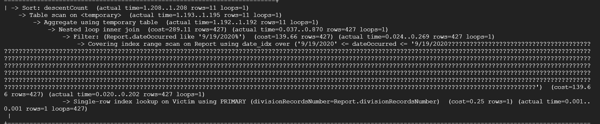

# DDL Code
CREATE TABLE Report(\
   &nbsp;&nbsp;&nbsp;&nbsp;&nbsp;&nbsp;Division of Records Number INT,\
   &nbsp;&nbsp;&nbsp;&nbsp;&nbsp;&nbsp;Date Reported DATE,\
   &nbsp;&nbsp;&nbsp;&nbsp;&nbsp;&nbsp;Date Occurred DATE, Time Occurred TIME,\
   &nbsp;&nbsp;&nbsp;&nbsp;&nbsp;&nbsp;Latitude REAL,\
   &nbsp;&nbsp;&nbsp;&nbsp;&nbsp;&nbsp;Longitude REAL,  
   &nbsp;&nbsp;&nbsp;&nbsp;&nbsp;&nbsp;Crime Code REAL,\
   &nbsp;&nbsp;&nbsp;&nbsp;&nbsp;&nbsp;Weapon Used Code INT,\
   &nbsp;&nbsp;&nbsp;&nbsp;&nbsp;&nbsp;MO Code REAL,\
   &nbsp;&nbsp;&nbsp;&nbsp;&nbsp;&nbsp;Area INT,  
   &nbsp;&nbsp;&nbsp;&nbsp;&nbsp;&nbsp;Premises Code INT,  
   &nbsp;&nbsp;&nbsp;&nbsp;&nbsp;&nbsp;PRIMARY KEY(Division of Records Number),  
   &nbsp;&nbsp;&nbsp;&nbsp;&nbsp;&nbsp;FOREIGN KEY(Crime Code) REFERENCES Crime Codes(Crime Code), \
   &nbsp;&nbsp;&nbsp;&nbsp;&nbsp;&nbsp;FOREIGN KEY(Weapon Used Code) REFERENCES Weapon(Weapon Used Code),\
   &nbsp;&nbsp;&nbsp;&nbsp;&nbsp;&nbsp;FOREIGN KEY(MO Code) REFERENCES Modus Operandi(MO Code), \
   &nbsp;&nbsp;&nbsp;&nbsp;&nbsp;&nbsp;FOREIGN KEY(Area) REFERENCES Location(Area), \
   &nbsp;&nbsp;&nbsp;&nbsp;&nbsp;&nbsp;FOREIGN KEY(Premises Code) REFERENCES Premises(Premises Code)\
);

CREATE TABLE Victim(\
   &nbsp;&nbsp;&nbsp;&nbsp;&nbsp;&nbsp;Division of Record Number INT, \
   &nbsp;&nbsp;&nbsp;&nbsp;&nbsp;&nbsp;Age INT,\
   &nbsp;&nbsp;&nbsp;&nbsp;&nbsp;&nbsp;Sex VARCHAR(255), \
   &nbsp;&nbsp;&nbsp;&nbsp;&nbsp;&nbsp;Descent VARCHAR(255), \
   &nbsp;&nbsp;&nbsp;&nbsp;&nbsp;&nbsp;Descent Description VARCHAR(255),  
   &nbsp;&nbsp;&nbsp;&nbsp;&nbsp;&nbsp;PRIMARY KEY(Division of Record Number)\
);

CREATE TABLE Premises(\
   &nbsp;&nbsp;&nbsp;&nbsp;&nbsp;&nbsp; Premises Code INT,\
   &nbsp;&nbsp;&nbsp;&nbsp;&nbsp;&nbsp; Premises Description VARCHAR(255),  
   &nbsp;&nbsp;&nbsp;&nbsp;&nbsp;&nbsp; PRIMARY KEY(Premises Code)\
);

CREATE TABLE Location(\
   &nbsp;&nbsp;&nbsp;&nbsp;&nbsp;&nbsp; Area INT,  
   &nbsp;&nbsp;&nbsp;&nbsp;&nbsp;&nbsp; Area Name VARCHAR(255),\ 
   &nbsp;&nbsp;&nbsp;&nbsp;&nbsp;&nbsp; PRIMARY KEY(Area)\
);

CREATE TABLE Weapon Used(\
    &nbsp;&nbsp;&nbsp;&nbsp;&nbsp;&nbsp;Weapon Used Code REAL,   
    &nbsp;&nbsp;&nbsp;&nbsp;&nbsp;&nbsp;Weapon Description VARCHAR(255),  
    &nbsp;&nbsp;&nbsp;&nbsp;&nbsp;&nbsp;PRIMARY KEY(Weapon Used Code)\
);

CREATE TABLE Modus Operandi(\
    &nbsp;&nbsp;&nbsp;&nbsp;&nbsp;&nbsp;MO Code REAL,  
    &nbsp;&nbsp;&nbsp;&nbsp;&nbsp;&nbsp;MO Description VARCHAR(255),  
    &nbsp;&nbsp;&nbsp;&nbsp;&nbsp;&nbsp;PRIMARY KEY(MO Code)  
);

CREATE TABLE Crime Codes(\
    &nbsp;&nbsp;&nbsp;&nbsp;&nbsp;&nbsp;Crime Code REAL,  
    &nbsp;&nbsp;&nbsp;&nbsp;&nbsp;&nbsp;Crime Code Description VARCHAR(255), \
    &nbsp;&nbsp;&nbsp;&nbsp;&nbsp;&nbsp;PRIMARY KEY(Crime Code)\
);

# Data tables

# SQL Queries
### What communities have the most crime in LA (ordering):
SELECT Location.areaName, COUNT(Location.areaName) AS CRIMECOUNT FROM (Report JOIN Location ON Location.area = Report.area) GROUP BY Location.areaName ORDER BY CRIMECOUNT LIMIT 15;

### What are the demographics of crime victims (age, sex, descent) IN A GIVEN YEAR
SELECT Victim.descent, COUNT(Victim.descent) AS descentCount FROM Victim JOIN Report ON Report.divisionRecordsNumber = Victim.divisionRecordsNumber WHERE YEAR(Report.dateOccurred) = 2021 GROUP BY Victim.descent ORDER by descentCount LIMIT 15;

# Index Analysis

## Query 1

### No Index

We noticed that there is a table scan on the report table, so we decided to try adding an index to the columns from that table that are used by this query.

### Index On Report.Area

The operations the use the Report table are now much faster, but the way that the query was reordered caused it to take longer than it did before. Now, it is doing a table scan on the Location table, so we will add an index on the columns of that table that don't have an index already.

### Index on Location.AreaName and Report.Area

Now, there are no more table scans, and the query runs much faster than it did originally. Just to see, we will check how much performance changes with only the Location.AreaName index.

### Index on Area and AreaName

We see that both indices are necessary to improve the performance of the query because the slow table scans are now back once we remove the index from the report table.

For our final indexing structure for this query, we decided to have an index on Location.AreaName and Report.Area, since that was the combination that resulted in the best possible query speed.

## Query 2

### No Index

There is a table scan on a temporary table, so to speed this up, we will try to add indices to columns that will be in this table.

### Index on Victim.victimDescent

Adding an index on columns in the temporary table didn't seem to make a difference, so we decided to try adding an index to the columns that we are filtering by.

### Index on Victim.victimDescent and Report.dateOccurred

This index improved the speed of the query drastically, since it was an index range scan instead of a filter operation on Report.dateOccurred. Finally, we decided to try without the index on victimDescent to see if it would make a difference.

### Index on Report.dateOccurred

Getting rid of the victimDescent index actually sped up the aggregation step, so for our final index structure, we will be having an index on only the Report.dateOccurred column for this query.
